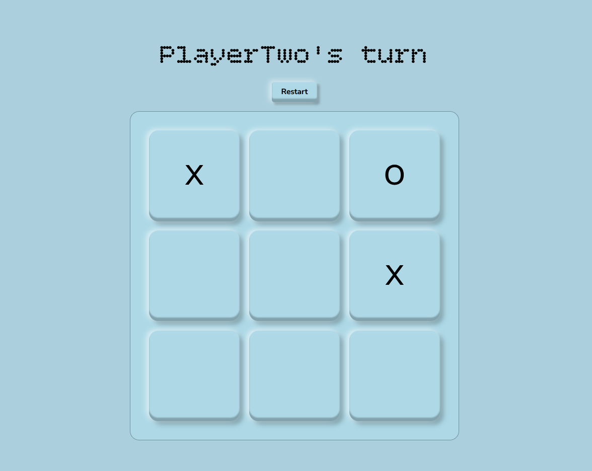

# Tic Tac Toe

<html>
	
</html>

## What I Learned
- Closures and factory functions: a factory function returns an object whose methods "close over" its internal variables, giving each instance its own private state.
- This achieves encapsulation similar to OOP classes, but through function scope rather than `this`/prototypes.
- Variables declared inside the factory are inaccessible from the outside — only the methods it returns can read or modify them.
- This keeps state out of the global scope, reducing accidental mutation and making the codebase easier to reason about.
